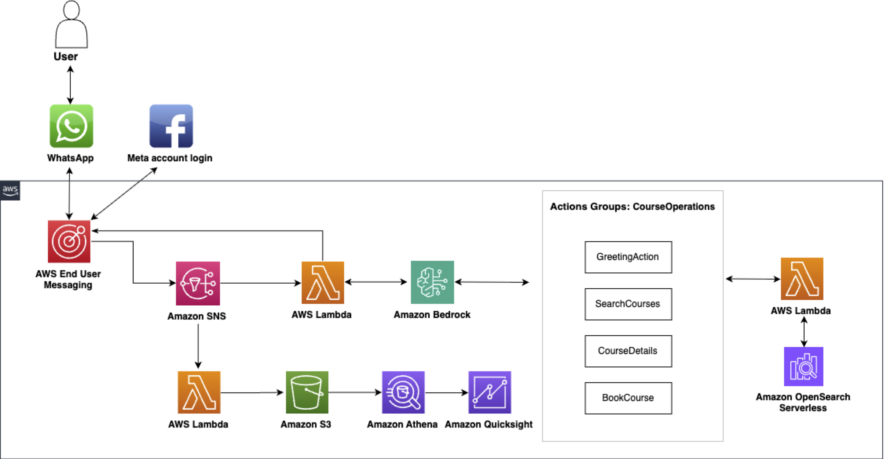

# WhatsApp Course Recommender with AWS End User Messaging and Amazon Bedrock

## Overview
This project demonstrates how to create a WhatsApp-based educational course recommendation system using AWS End User Messaging for social integration and Amazon Bedrock for AI-powered interactions. The application helps users find and book educational courses through a conversational interface.

## Architecture



### Flow

1. User sends a message via WhatsApp Business
2. Message is routed to AWS End User Messaging Social service
3. Event is published to SNS topic and triggers the WhatsApp Forwarder Lambda
4. The WhatsApp Forwarder Lambda:
   - Forwards the message to the Bedrock Agent
   - Sends the agent's response back to the user via WhatsApp
5. The Bedrock Agent:
   - Understands user intent using foundation models
   - Invokes action groups to search courses in OpenSearch
   - Handles the course booking process
6. Responses are sent back through AWS End User Messaging to WhatsApp
7. All WhatsApp messages are also sent to an analytics pipeline for reporting and insights

## Components

The project consists of five main CDK stacks:

1. **OpenSearch Stack**: Creates an OpenSearch Serverless collection for storing and searching course data
2. **WhatsApp Course Recommender Stack**: Creates the main application components including:
   - SNS topic for WhatsApp events
   - Agent actions Lambda function
   - WhatsApp forwarder Lambda function
3. **Bedrock Agent Stack**: Creates a Bedrock Agent with:
   - Action groups for course operations
4. **Update Lambda Stack**: Updates the WhatsApp forwarder Lambda with the Bedrock Agent IDs
5. **Analytics Stack**: Creates analytics components including:
   - S3 bucket for storing WhatsApp message data
   - Lambda function to process and store WhatsApp messages
   - Glue database and table for querying message data
   - Athena workgroup for analytics queries

## Prerequisites

1. AWS Account with access to:
   - AWS End User Messaging
   - Amazon Bedrock
   - Amazon OpenSearch Service
   - AWS Lambda, SNS
   - AWS Glue, Athena, S3

2. WhatsApp Business Account (WABA) linked to AWS End User Messaging

3. Development environment with:
   - Python 3.9+
   - AWS CDK installed and configured
   - AWS CLI configured

## Deployment

### 1. Clone the repository

```bash
git clone <repository-url>
cd whatsapp-course-recommender
```

### 2. Create a virtual environment

```bash
python -m venv .venv
source .venv/bin/activate  # On Windows: .venv\\Scripts\\activate
pip install -r requirements.txt
```

### 3. Create Lambda layers

```bash
cd lambdas/layers/opensearch
chmod +x create_layer.sh
./create_layer.sh
cd ../../..
```

### 4. Deploy the stack

If you want to create a new OpenSearch collection:

```bash
cdk bootstrap  # If you haven't bootstrapped your environment
cdk deploy --all --parameters WhatsappCourseRecommenderStack:WhatsAppOriginationNumber=<phone-number-id-eum>
```

If you want to use an existing OpenSearch endpoint:

```bash
cdk bootstrap  # If you haven't bootstrapped your environment
cdk deploy --all --parameters WhatsappCourseRecommenderStack:WhatsAppOriginationNumber=<phone-number-id-eum> --context opensearch_endpoint=your-opensearch-endpoint
```

This will deploy all stacks in the correct order:
1. The OpenSearch Serverless collection
2. The main WhatsApp Course Recommender stack
3. The Bedrock Agent stack
4. The Update Lambda stack
5. The Analytics stack

### 5. Index sample course data

After deployment, index some sample course data:

```bash
# Get the OpenSearch endpoint from the stack output
OPENSEARCH_ENDPOINT=$(aws cloudformation describe-stacks --stack-name WhatsappCourseRecommenderOpenSearchStack --query "Stacks[0].Outputs[?OutputKey=='CollectionEndpoint'].OutputValue" --output text)

# Run the indexing script
python scripts/index_sample_courses.py --endpoint $OPENSEARCH_ENDPOINT
```

### 6. Configure Event Destination

After deployment:
1. Go to the AWS End User Messaging console
2. Set up the SNS topic (from CDK output) as your event destination

## Usage

Once deployed, users can interact with the system via WhatsApp:

1. **Search for Courses**: Users can ask about courses in any subject area
   - Example: "I'm looking for beginner Python courses under $100"

2. **View Course Details**: Users can request more information about courses
   - Example: "Tell me more about the Python course"

3. **Book Courses**: Users can book courses through a guided conversation
   - Example: "I want to book the Python course"

The Bedrock Agent handles the entire conversation flow, maintaining context and providing appropriate responses based on the user's intent.

## Analytics

The project includes a comprehensive analytics solution:

1. **Data Collection**: All WhatsApp messages are automatically stored in S3 with proper partitioning
2. **Data Structure**: Messages are stored with the following schema:
   - message_id: Unique identifier for the message
   - event_date: Date of the message (YYYY-MM-DD)
   - event_time: Time of the message (HH:MM:SS)
   - aws_account_id: AWS account ID
   - status: Message status (received, delivered, read, etc.)
   - recipient_id: WhatsApp recipient ID
   - conversation_id: Conversation identifier
   - billable: Whether the message is billable
   - pricing_model: Pricing model for the message
   - pricing_category: Pricing category for the message
   - template_name: Name of the template (if applicable)
   - template_language: Language of the template (if applicable)

3. **Querying Data**: You can query the data using Athena with the provided workgroup
4. **Visualization**: Connect Amazon QuickSight to the Athena table for dashboards and visualizations

### Example Athena Queries

```sql
-- Count messages by date
SELECT event_date, COUNT(*) as message_count
FROM whatsapp_course_recommender_db.whatsapp_messages
GROUP BY event_date
ORDER BY event_date DESC;

-- Count messages by status
SELECT status, COUNT(*) as count
FROM whatsapp_course_recommender_db.whatsapp_messages
GROUP BY status
ORDER BY count DESC;

-- Template usage statistics
SELECT template_name, COUNT(*) as usage_count
FROM whatsapp_course_recommender_db.whatsapp_messages
WHERE template_name IS NOT NULL
GROUP BY template_name
ORDER BY usage_count DESC;
```

## QuickSight Dashboard

The project includes integration with Amazon QuickSight for visualizing WhatsApp analytics data:

1. **Automated Setup**: CDK automatically creates:
   - QuickSight data source connected to Athena
   - QuickSight dataset with WhatsApp message data
   - Empty QuickSight analysis ready for visualization design

2. **Creating Visualizations**:
   After deployment, follow these steps to create visualizations:
   
   a. Navigate to the QuickSight console using the URL from the stack outputs
   b. Open the "WhatsApp Analytics Analysis"
   c. Add visualizations using the dataset fields:
      - Message counts by date (bar chart)
      - Message status distribution (pie chart)
      - Template usage (table)
      - Conversation metrics (KPIs)
   d. Save the analysis
   e. Publish the analysis as a dashboard

3. **Suggested Visualizations**:
   - **Message Volume**: Line chart of message count by date
   - **Status Distribution**: Pie chart of message statuses
   - **Template Performance**: Bar chart of template usage
   - **Conversation Metrics**: KPIs for total conversations, average messages per conversation
   - **Pricing Analysis**: Stacked bar chart of billable vs. non-billable messages

## Security
See [CONTRIBUTING](CONTRIBUTING.md#security-issue-notifications) for more information.

## License
This library is licensed under the MIT-0 License. See the [LICENSE](LICENSE) file.
